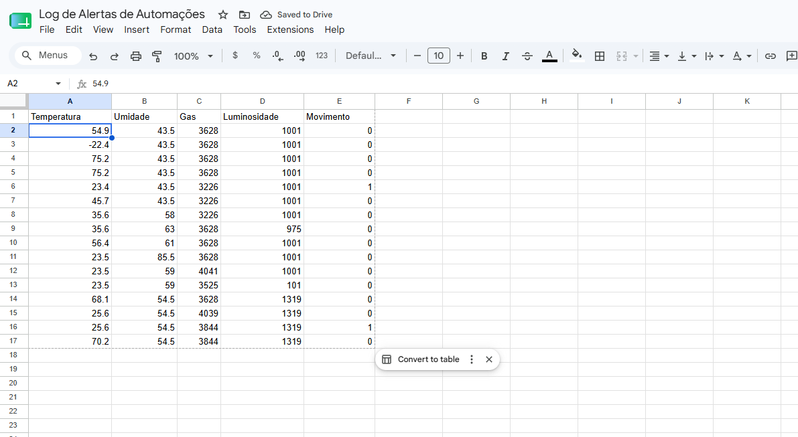
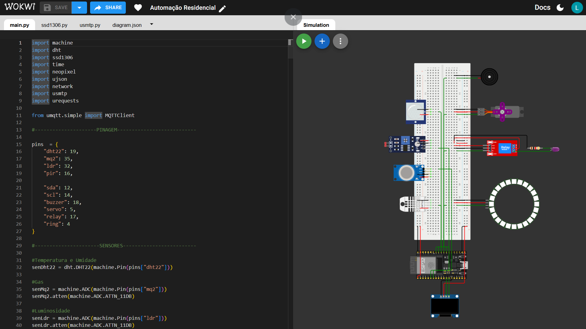

# 🏠 Sistema de Automação Residencial com ESP32, MicroPython, MQTT e Node-RED

Projeto desenvolvido para a disciplina de **Internet das Coisas (IoT)** da Universidade de Mogi das Cruzes (UMC).

## 📌 Sobre o Projeto

Este projeto consiste em um sistema de automação residencial desenvolvido utilizando **ESP32 com MicroPython**, integrado com sensores, atuadores e serviços em nuvem.

A aplicação realiza:

- monitoramento ambiental em tempo real;
- controle remoto de dispositivos;
- registro automático de eventos;
- geração de alertas;
- envio de notificações por e-mail;
- armazenamento dos dados no Google Sheets.

Toda a solução foi desenvolvida e simulada no **Wokwi**, permitindo testar o sistema completo sem necessidade de hardware físico.

---

## 🚀 Tecnologias Utilizadas

### Hardware / Simulação

- ESP32
- DHT22
- MQ-2
- LDR
- PIR
- OLED SSD1306
- Servo Motor
- Relay Module
- Buzzer
- LED Ring WS2812

### Software

- MicroPython
- MQTT
- HiveMQ Cloud
- Node-RED
- Google Apps Script
- Google Sheets
- SMTP (Gmail)
- Wokwi Simulator
- Visual Studio Code

---

## 🧠 Arquitetura do Sistema

```text
Sensores → ESP32 → MQTT Broker (HiveMQ) → Node-RED Dashboard
                 ↓
         Google Sheets (logs)
                 ↓
        E-mail de alertas automáticos
```

---

## 📡 Sensores Utilizados

### 🌡️ DHT22

Responsável pela leitura de:

- temperatura
- umidade do ar

### 🔥 MQ-2

Utilizado para detecção de:

- fumaça
- gases
- qualidade do ar

### 💡 LDR

Responsável pela leitura de luminosidade ambiente.

### 🚶 PIR

Sensor de presença e movimento.

---

## ⚙️ Atuadores Utilizados

### 📺 Display OLED SSD1306

Exibe:

- temperatura
- umidade
- gás
- luminosidade
- movimento
- mensagens de alerta

### 🔔 Buzzer

Disparo sonoro em eventos críticos.

### 🔄 Servo Motor

Simula abertura e fechamento automático.

Comandos disponíveis:

- `servo_open`
- `servo_close`

### ⚡ Relé

Simula acionamento de equipamentos elétricos.

Comandos disponíveis:

- `relay_on`
- `relay_off`

### 🌈 LED Ring WS2812

Usado como sinalizador visual do estado do sistema e alertas.

---

## 📁 Estrutura do Projeto

```bash
AutoResidencial/
│
├── main.py
├── ssd1306.py
├── usmtp.py
├── diagram.json
├── wokwi.toml
├── scripts/
│   └── google-apps-script.js
└── Config/
    ├── ESP32_GENERIC.bin
    └── ESP32_GENERIC.elf
```

---

## 🔌 Comunicação MQTT

A comunicação entre o ESP32 e o dashboard é realizada através do **HiveMQ Cloud** utilizando o protocolo MQTT.

### Tópicos utilizados

#### Publicação de dados dos sensores

```bash
resauto/data
```

#### Recebimento de comandos

```bash
resauto/action
```

### Comandos disponíveis

```bash
relay_on
relay_off
servo_open
servo_close
alarm
ring_on
```

---

## 📊 Dashboard Node-RED

A dashboard exibe em tempo real:

- temperatura
- umidade
- gás
- luminosidade
- movimento

Também permite controlar remotamente:

- relé
- servo motor
- buzzer
- LED Ring

---

## 🚨 Sistema de Alertas

O sistema monitora continuamente os sensores e detecta situações anormais.

Quando um alerta é identificado:

- exibição da mensagem no display OLED;
- acionamento do buzzer;
- sinalização visual com LED Ring em vermelho;
- registro automático no Google Sheets;
- envio de notificação por e-mail.

### Exemplo de validação de temperatura

```python
if not (18 < temp < 35):
```

---

## 📝 Registro no Google Sheets

Quando ocorre um alerta, o ESP32 envia uma requisição HTTP POST contendo os dados dos sensores em formato JSON:

```json
{
  "Temperatura": 27,
  "Umidade": 64,
  "Gas": 302,
  "Luminosidade": 890,
  "Movimento": 1
}
```

Esses dados são processados pelo **Google Apps Script** e registrados automaticamente em uma planilha.

### Google Apps Script

Arquivo responsável por receber os dados enviados pelo ESP32 e registrar automaticamente no Google Sheets:

```bash
/scripts/google-apps-script.js
```

Esse script é publicado como **Web App** e utilizado pelo `main.py` para envio dos dados.

---

## 📧 Notificações por E-mail

Quando uma condição crítica é detectada, o sistema envia automaticamente um e-mail contendo:

- tipo do alerta;
- temperatura;
- umidade;
- nível de gás;
- luminosidade;
- detecção de movimento.

---

## 🛠️ Como Executar o Projeto

### 1. Clonar o repositório

```bash
git clone https://github.com/seu-usuario/seu-repo.git
```

### 2. Abrir no Wokwi ou Visual Studio Code

Arquivos principais:

```bash
main.py
diagram.json
wokwi.toml
```

### 3. Configurar credenciais no `main.py`

#### Wi-Fi

```python
ssid = "SEU_WIFI"
password = "SUA_SENHA"
```

#### MQTT

```python
broker = "broker.hivemq.cloud"
user = "SEU_USUARIO"
password = "SUA_SENHA"
```

#### SMTP Gmail

```python
emailSender = "seuemail@gmail.com"
emailPassword = "sua_senha"
emailRecipient = "destinatario@gmail.com"
```

#### Google Apps Script

```python
appScriptsURL = "SUA_URL_WEBAPP"
```

---

## ▶️ Execução

Após a configuração, execute a simulação no Wokwi.

O ESP32 iniciará:

- leitura contínua dos sensores;
- envio de dados via MQTT;
- monitoramento de alertas;
- envio automático de e-mails;
- registro dos eventos no Google Sheets.

---

## 📷 Demonstração




---

## 🎓 Projeto Acadêmico

**Universidade de Mogi das Cruzes — UMC**  
**Curso:** Engenharia de Software  
**Disciplina:** Internet das Coisas (IoT)

**Aluno:** Luiz Eduardo Dias  
**RA:** 11231104074  

**Professor:** Alessandro Horas  

**Ano:** 2026

---

## 📄 Licença

Projeto desenvolvido para fins acadêmicos.
